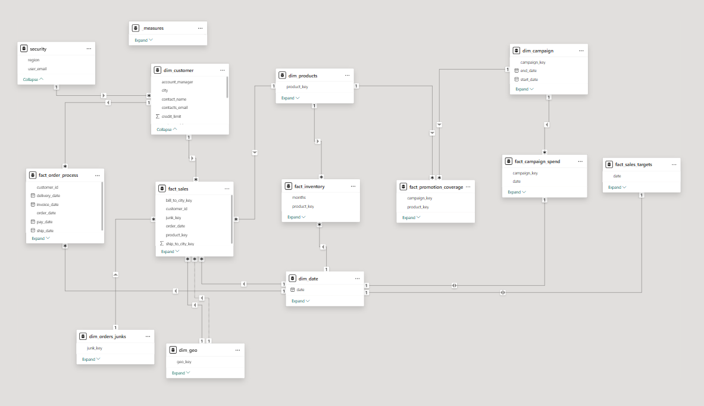

# 📊 Power BI Data Modeling Project

## 📌 Project Overview

This project demonstrates the design and implementation of a scalable Power BI data model using dimensional modeling techniques. The objective was to transform raw relational business data into an optimized semantic model that supports efficient business intelligence reporting and analytics.

The project integrates multiple business domains—including sales, customers, products, inventory, campaigns, geography, and order processing—into a unified analytical model by establishing optimized relationships, creating reusable DAX measures, and implementing a Star Schema architecture.

---

## 🎯 Project Objectives

- Design an optimized Power BI data model.
- Transform raw business data into an analytical model.
- Implement dimensional modeling using Star Schema principles.
- Create relationships between fact and dimension tables.
- Improve reporting performance and scalability.
- Develop reusable DAX measures for business KPIs.
- Build a centralized data model for future dashboard development.

---

# 🛠️ Tools & Technologies

- Power BI Desktop
- Power Query
- DAX (Data Analysis Expressions)
- Microsoft Excel
- Data Modeling
- ETL
- Star Schema
- Relational Database Concepts

---

# 📂 Dataset

The dataset consists of multiple business entities representing various operational processes.

The data includes information related to:

- Sales Transactions
- Customers
- Products
- Inventory
- Orders
- Campaigns
- Marketing Spend
- Promotion Coverage
- Geography
- Calendar Dates

The data was imported from Excel and transformed inside Power BI.

---

# 🏗️ Data Modeling Architecture

The project follows a dimensional modeling approach using Star Schema principles.

### Fact Tables

- Fact Sales
- Fact Inventory
- Fact Order Process
- Fact Campaign Spend
- Fact Promotion Coverage
- Fact Sales Targets

### Dimension Tables

- Customer Dimension
- Product Dimension
- Date Dimension
- Geography Dimension
- Campaign Dimension
- Order Junk Dimension

Additional supporting tables include:

- Measures Table
- Security Table

---

# ⭐ Data Modeling Features

- Integrated **12 relational tables** into a single semantic model.
- Created **6 Fact Tables** and **6 Dimension Tables**.
- Built multiple **One-to-Many Relationships**.
- Designed a scalable Star Schema architecture.
- Organized business calculations within a dedicated Measures table.
- Used a centralized Date Dimension for time intelligence.
- Structured the model for improved readability and maintainability.

---

# 🔄 Data Transformation

Power Query was used for data preparation, including:

- Data import
- Data type conversion
- Data cleaning
- Removing inconsistencies
- Preparing lookup tables
- Structuring dimension tables
- Creating an analytics-ready dataset

---

# 📈 DAX Implementation

The project includes DAX calculations for:

- Business KPIs
- Aggregations
- Calculated Columns
- Measures
- Time-based calculations
- Analytical reporting

A dedicated Measures table was created to improve model organization and maintainability.

---

# 🏛️ Data Model

The model consists of interconnected fact and dimension tables designed using dimensional modeling best practices.

## Data Model 



---

---

# 🚀 Skills Demonstrated

This project demonstrates practical experience in:

- Power BI
- Data Modeling
- Star Schema Design
- Dimensional Modeling
- Data Transformation
- Power Query
- DAX
- ETL
- Relationship Management
- Business Intelligence
- Data Analytics
- KPI Development

---

# 📁 Repository Structure

```
power-bi-data-modeling-project/
│
├──  Dataset/
│    └── dataset.xlsx
├──  Images/
│    └── Data_Model.png
├──  Power BI File/
│    └──  Data_Modeling_Project.pbix
└── README.md
```

---

# 📚 Learning Outcomes

Through this project, I gained hands-on experience in:

- Designing enterprise-style Power BI data models.
- Implementing Star Schema architecture.
- Creating optimized table relationships.
- Applying Power BI modeling best practices.
- Building reusable DAX calculations.
- Organizing semantic models for scalable business reporting.

---

# 👩‍💻 Author

**Diya Chaudhary**

Aspiring Data Analyst | Business Analyst | Business Intelligence Enthusiast

### Skills

Power BI • SQL • Python • Excel • Tableau • DAX • Power Query • Business Analytics • Data Visualization • Data Modeling

---

## ⭐ If you found this project useful, consider giving it a star!
